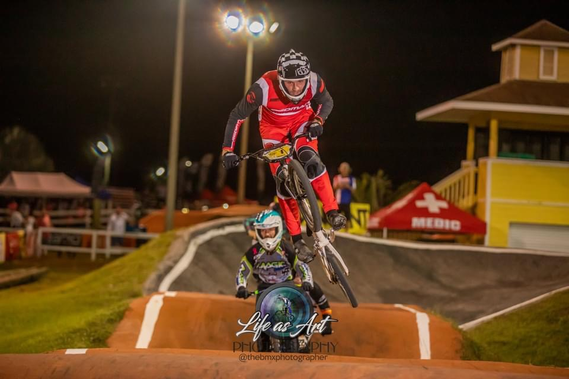
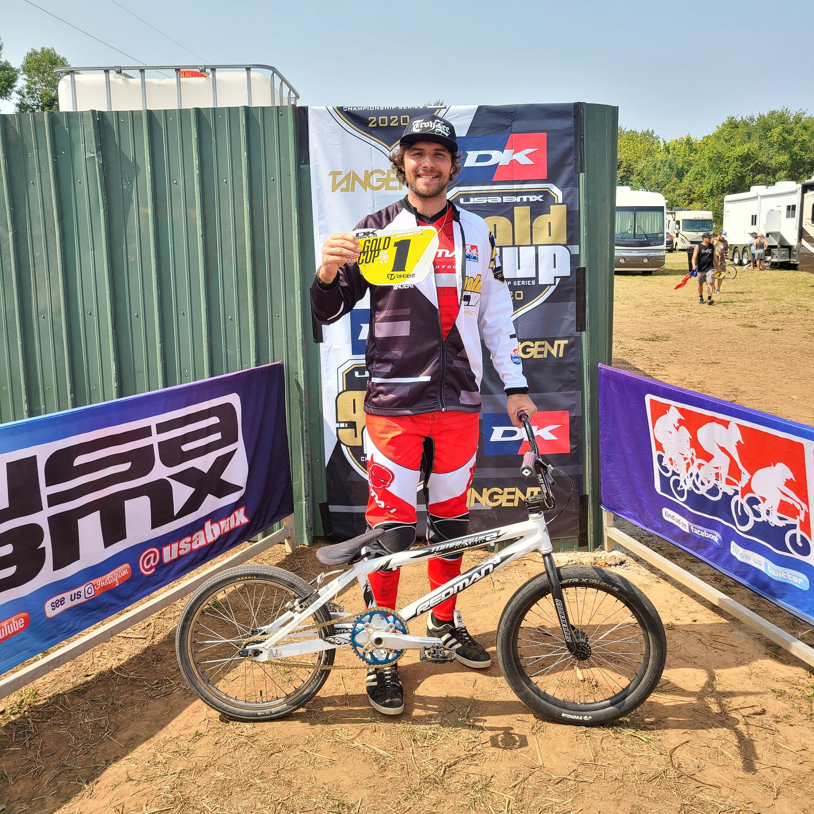
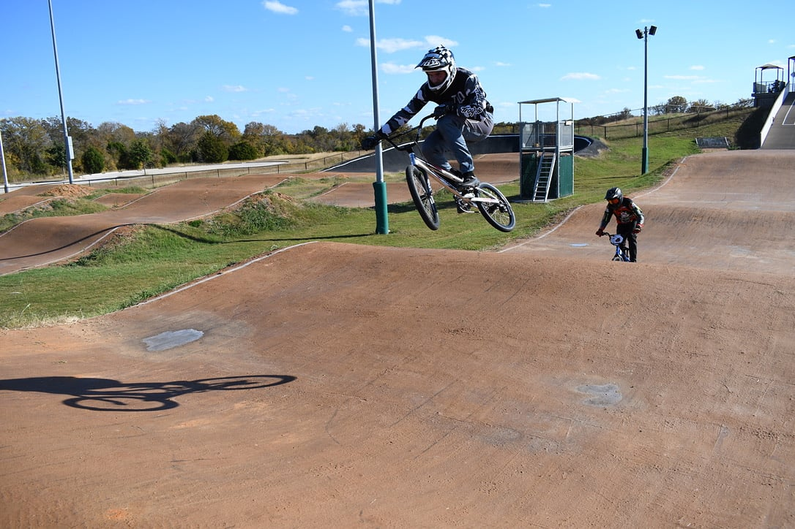
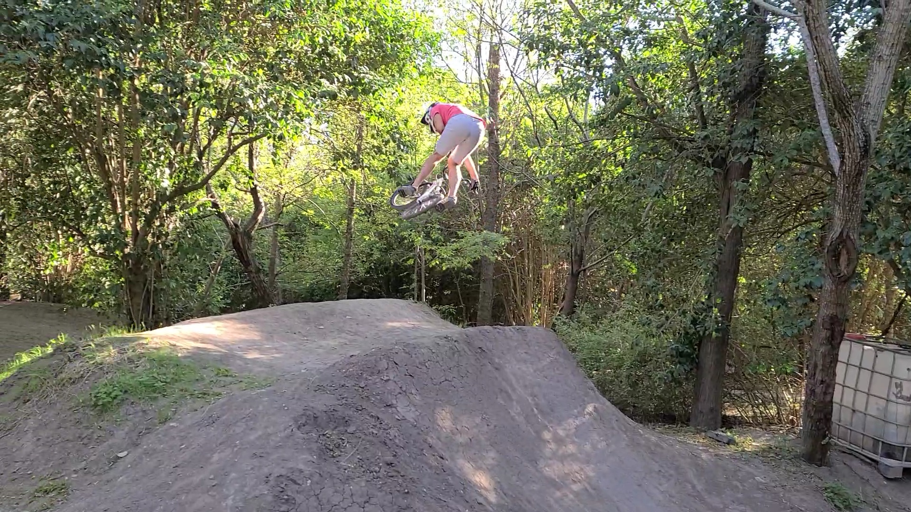
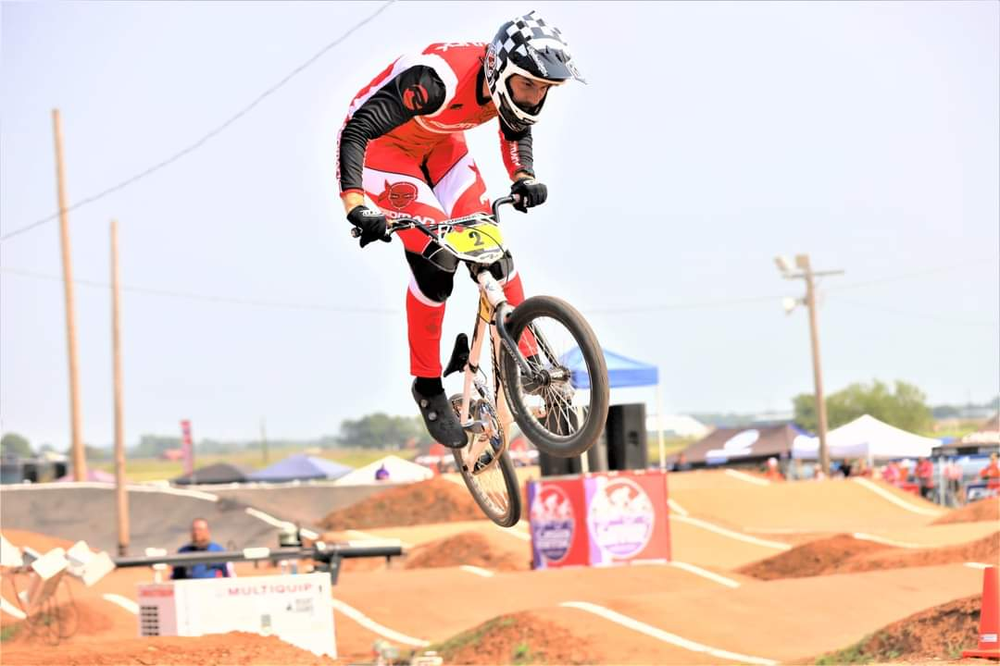

# John Pavlick - 26-35x
* Phone: (810) 288-0374
* Email: john@pavlick.dev

## About

I started racing BMX in 2012, as a 21-year-old with no prior background in BMX or athletic competition. Since then, I have been tirelessly working to develop as an athlete and rider, so that I can compete with the top amateurs in the world. 2021 will be my 10th season.

In October 2019, I moved from the Flint, Michigan area to Austin, Texas - not only to advance my career, but also to have more opportunities to train / travel / race. I started working with Tanner Sebesta in March of 2020, and finished NAG 8 for the 2020 season. 2020 was the first year that I had the opportunity to travel and race a full national season, and I am very excited about the progress that I made. From the time that I turned Expert in 2013 until 2020, I had only made two national Expert main events; in 2020, I made nearly every National main that I competed in, and I finished the season with 9 podium finishes.

My goals for the 2021 season are to continue to develop myself as an athlete and rider, and to finish in the top 3 positions for 26-35 Men. I am going to continue to work with Tanner to attack my weaknesses, capitalize on my strengths, and continue to pursue consistency in my training and racing.

In addition to racing, I am a certified USABMX coach. I enjoy working with development-stage riders. I learned everything I know about this sport as an adult, and I believe that this gives me a very process-oriented perspective for teaching basic skills.

I work as a software developer in data, reporting, and analytics. I telecommute full-time, and this gives me a competitive advantage; I am able to consistently train 6 days per week, and travel for races as much as I like.

## 2020 National Series Results
### Overall Finish: 26-35 Men NAG 8: 1730 Points

### Highlight Reel

#### Punta Gorda, FL - 1st Place
<iframe width="762" height="428" src="https://www.youtube.com/embed/LxJcUD_cYQQ?start=7504" frameborder="0" allow="accelerometer; autoplay; clipboard-write; encrypted-media; gyroscope; picture-in-picture" allowfullscreen></iframe>

#### Portage, IN - 2nd Place
<iframe width="762" height="428" src="https://www.youtube.com/embed/h8ltKdxlWyk?start=19520" frameborder="0" allow="accelerometer; autoplay; clipboard-write; encrypted-media; gyroscope; picture-in-picture" allowfullscreen></iframe>

#### Louisville, KY - 2nd Place
<iframe width="762" height="428" src="https://www.youtube.com/embed/0v1X4MjaC_I?start=20886" frameborder="0" allow="accelerometer; autoplay; clipboard-write; encrypted-media; gyroscope; picture-in-picture" allowfullscreen></iframe>

#### All National Results

|Finish|Race|Date|
|--|--|--|
|1st|Punta Gorda, FL|10/23/2020|
|2nd|Louisville, KY|10/18/2020|
|2nd|Rock Hill, SC|9/5/2020|
|2nd|Rock Hill, SC|9/4/2020|
|2nd|Portage, IN|7/3/2020|
|3rd|Rock Hill, SC|9/6/2020|
|3rd|Toledo, OH|7/26/2020|
|3rd|Portage, IN|7/5/2020|
|3rd|Pryor Creek, OK|6/7/2020|
|4th|Punta Gorda, FL|10/25/2020|
|4th|Punta Gorda, FL|10/24/2020|
|5th|Portage, IN|7/4/2020|
|6th|Toledo, OH|7/25/2020|
|6th|Pryor Creek, OK|6/6/2020|
|6th|Pryor Creek, OK|6/5/2020|
|7th|Louisvile, KY|10/17/2020|

## 2020 Gold Cup Results

### Overall Finish: 26-35 Expert GC 1: 83 Points

|Finish|Race|Date|
|--|--|--|
|1st|South Central Gold Cup Final - Yukon, OK|9/20/2020|
|1st|South Central Gold Cup Final - Yukon, OK|9/19/2020|
|1st|Qualifier - Yukon, OK|9/18/2020|
|2nd|Qualifier - Midland, TX|6/28/2020|

## Past Career Results
* 2019 26-35x North Central Gold Cup 2
* 2018 26-25x and 26-30c Northeast Gold Cup 1
* 2017 26-30c North Central Gold Cup 1
* 2017 25-29c Worlds Team Qualifier

## References
* Tanner Sebesta : (512) 508-5001
* Howard "Hojo" Johnson: (210) 386-2280
* Dennis "Yogi" Ybarra - Track Operator, Richfield Park BMX: (810) 919-2086
* Austin Kelly - Track Operator, Richfield Park BMX: (810) 441-6193

## Gallery

